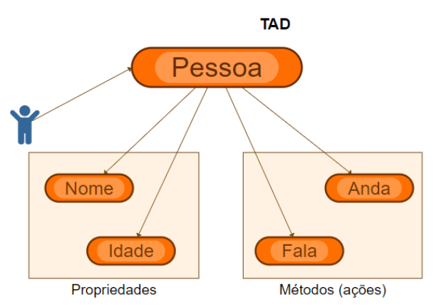
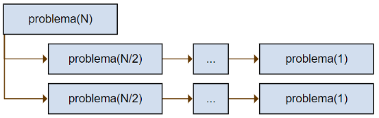
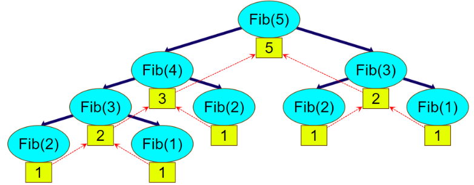
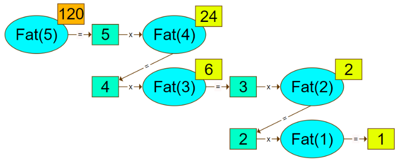

# Projetos Spring

Aqui são listados alguns projetos feitos em Java. 

O estudo da linguagem, sua evolução e aplicações Orientadas a Objetos faz parte da minha natureza.

## Projetos intrínsecos

Um Tipo Abstrato de Dados (TAD) pode facilmente ser entendido como a representação de um objeto o que é intrínseco à linguagem Java.

Quando desejamos abstrair o comportamento e propriedades inerentes a um determinado conjunto de indivíduos concordamos em implementar a classe desses indivíduos que são então denominados objetos.



```java
public class Pessoa {
 private String nome;
 private int idade;
 public String getNome() {
  return nome;
 }
 public void setNome(String nome) {
  this.nome = nome;
 }
 public int getIdade() {
  return idade;
 }
 public void setIdade(int idade) {
  this.idade = idade;
 }
 public void anda() {
  // ...
 }
 public void fala() {
  // ...
 }
}

```

Dessa forma, temos que uma classe que representa um conjunto de objetos pode ser encarada como um TAD.

Para um TAD em comparação a um objeto o que se tem é que são especificados os dados (atributos) e ações (métodos) a serem utilizados sobre aquele TAD (Classe/Objeto).

## Recursividade

A recursividade é uma técnica algorítmica que pressupõe a resolução de um problema dividindo-o em pequenas partes até que se consiga obter uma parte tão pequena que seja facilmente resolvível.

A seguir temos um modelo de exemplo:



Assim observamos que um problema de tamanho N pode ser derivado em pequenos problemas sucessivamente e que ao se atingir um problema de tamanho 1 (um) o mesmo já possui resolução unívoca bastando assim unir as respostas de cada problema (subproblema).

Dessa forma, a recursividade é dada pela obtenção de dois itens:
* O termo geral 
  * O termo geral → é a função que deriva o cálculo dos demais termos da sequência de resolução.
* O critério de parada
  * O critério de parada → é o menor subproblema de onde se obtém a resolução propriamente dita sem esforço.

### Exemplo 1 - Sequência de Fibonacci

A sequência de Fibonacci é uma sequência numérica tal que possui os seguintes termos:

1, 1, 2, 3, 5, 8, 13,...

Facilmente se observa que cada termo é dado pela soma dos dois termos imediatamente anteriores e que a sequência se inicia com 1 e 1.

Assim sendo, pode-se nomear uma função Fib(N) onde N é o índice do enésimo termo e Fib é a função aplicada na obtenção do valor deste termo. Assim:

$$
Fib(N) = \begin{cases}
 1, &\text{se } N = 1 \\
 1, &\text{se } N = 2 \\
 Fib(N-1) + Fib(N-2), &\text{se }N > 2
\end{cases}
$$

Ressaltando que os termos começam em 1 (um).

A figura a seguir demonstra o cálculo do 5o número da sequência.



Imaginando uma árvore e partindo da raiz Fib(5) deve-se chegar até as folhas Fib(1) ou Fib(2) que são os critérios de parada. Após chegar ao critério de parada então se calcula cada termo subsequente até chegar ao termo pretendido.

Uma construção algorítmica para o problema dado é tal como:

```java
/**
  * calcula o enesimo termo da sequencia de fibonacci
  *
  * @param x índice na sequencia
  * @return o termo
  */
 public static long fib(long x) {
  if (x == 1) {
   return 1;
  }
  if (x == 2) {
   return 1;
  }
  return fib(x - 1) + fib(x - 2);
 }
```

### Exemplo 2 - Fatorial

O fatorial de um número N é dado pela sequência de multiplicações entre 1 e todos os números até N.

$$
Fat(N) = \begin{cases}
 1, &\text{se } N = 1 \\
 N \times Fat(N-1) &\text{se } N > 1
\end{cases}
$$

Uma implementação algorítmica para o cálculo do fatorial pode ser dada como:

```java
/**
  * Calculo do fatorial de N
  * @param n
  * @return
  */
 public static long fat(long n) {
  //critério de parada
  if (n == 1)
   return 1;
  //termo geral
  return n * fat(n - 1);
 }
 ```

A representação pode ser vista na próxima figura onde em azul tem-se a chamada a função, em verde os números que são usados no termo geral e em amarelo os resultados intermediários até chegar no resultado final em laranja para o cálculo do fatorial de 5.



A análise é facilmente visualizada de forma invertida, assim:

1. Fat(1) = 1
2. Fat(2) = 2 * Fat(1) = 2 * 1 = 2
3. Fat(3) = 3 * Fat(2) = 3 * 2 = 6
4. Fat(4) = 4 * Fat(3) = 4 * 6 = 24
5. Fat(5) = 5 * Fat(4) = 5 * 24 = 120

